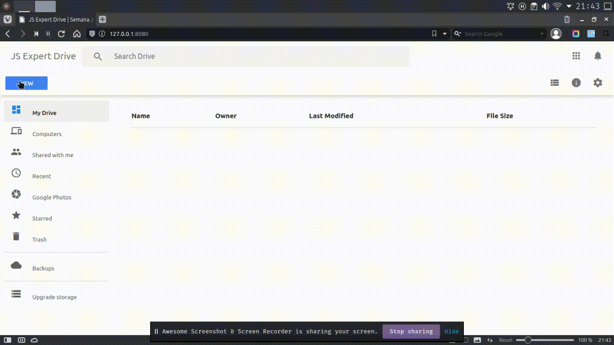

# Description

An implementation of uploading files on node using the new node 16v features, such as the pipeline function. The socket.io library is also used to monitor the upload progress of each file. This project doesn't even use a framework taking advantage only of libraries and native resources of node.

## Requirements

Node.js v16.0 and later.

## How to user

```bash

  # clone the repository
  $ git clone https://github.com/RodSilvaSoul/node-upload-implementation.git

  #enter in each folder and run npm instal or yarn

  #run npm start on each sub folders, first in the backend folder and after on the frontend
  $ npm start
```

## Application preview


